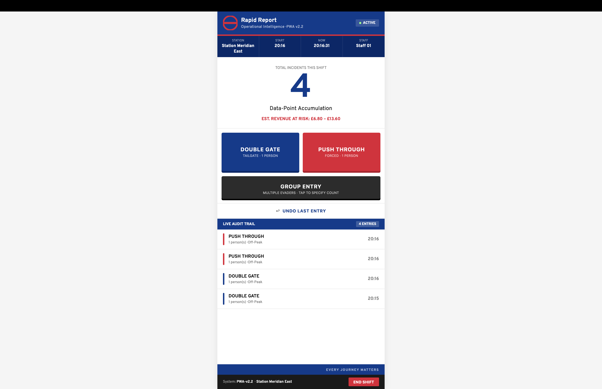
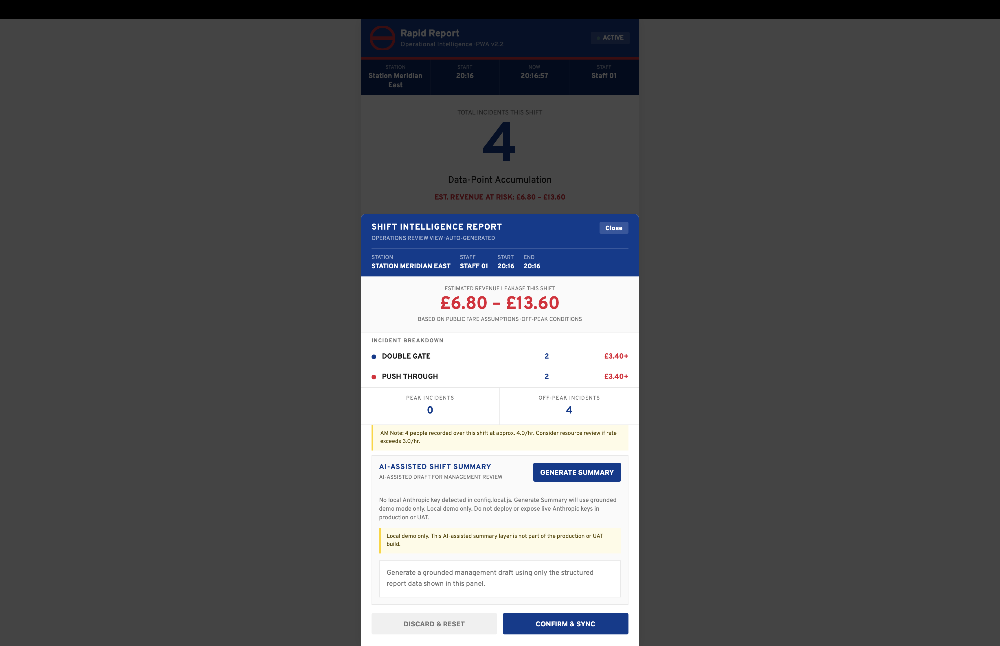
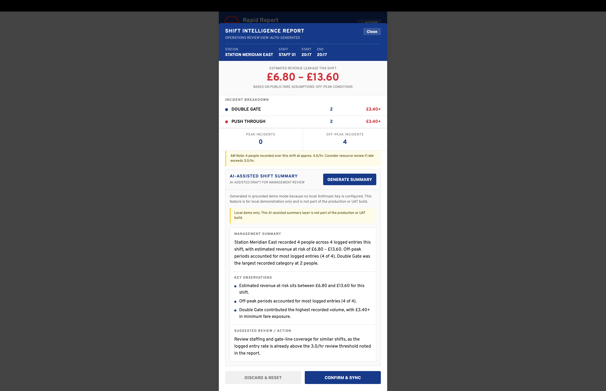

# Rapid Report

**Offline-first frontline intelligence PWA for fast revenue-leakage reporting**

Rapid Report is an offline-first, installable Progressive Web App built to help frontline staff log gate-line revenue leakage events quickly while maintaining operational awareness.

The project was built from direct frontline experience in a busy public transport environment, where existing reporting workflows can be too slow for real-time use during active customer flow.

---

## Live demo / screenshots

### One-tap frontline logging flow

Rapid Report is designed for fast, eyes-up logging at the gate line. The operator can record common incident types with a single thumb tap while the app maintains a live audit trail and revenue-at-risk estimate.



---

### Shift intelligence report

At the end of a shift, the app generates an operations-review intelligence report showing incident totals, peak/off-peak split, incident breakdown, estimated revenue leakage, and a contextual AM note.



---

### Local-only AI-assisted management summary

A separate application/demo-only branch explores how structured shift data could support AI-assisted management summaries.

This is deliberately kept separate from the operational version.



---

## Why I built it

The core problem was reporting friction.

In the existing process, recording fare evasion or anti-social behaviour could take too long for a lone frontline operator to use safely while still watching the gate line. In a busy ticket hall, losing situational awareness for even a few seconds matters.

That created a wider visibility problem: if events are not captured quickly and consistently, management and enforcement teams do not get a clear picture of what is actually happening on the ground.

Rapid Report was built to reduce that friction to a single-thumb-tap workflow and turn frontline observations into structured shift intelligence.

---

## What it does

Rapid Report allows a frontline operator to:

- log gate-line incidents with one tap
- distinguish common event types such as double-gating, push-throughs, and group entry
- automatically calculate peak/off-peak revenue-at-risk ranges
- maintain a live audit trail of recent incidents
- generate an end-of-shift intelligence report
- work offline through a cache-first PWA design
- preserve shift data locally until the shift is ended

The goal is not just faster logging.

The goal is better visibility.

---

## Key features

### One-tap incident logging

The UI is optimized for quick thumb-based recording during live gate-line conditions.

The app currently supports:

- **Double Gate**
- **Push Through**
- **Group Entry**

Each entry is timestamped, tagged, and added to the live audit trail.

---

### Revenue-at-risk calculation

Each incident is mapped to a peak or off-peak fare range at the moment of logging.

The app uses a separate `revenue.js` module to determine:

- whether the incident occurred during a peak-period fare window
- the applicable fare range
- estimated revenue leakage for the shift

The revenue estimate is intentionally expressed as a range rather than a false single-value certainty.

---

### Shift intelligence report

At the end of a shift, Rapid Report generates an intelligence modal showing:

- station
- staff label
- shift start / end
- estimated revenue leakage
- incident breakdown
- peak / off-peak split
- incident rate
- recommended review threshold context

This modal is shown on-device for demo purposes. In a production architecture, this type of report would be sent to an appropriate management or analytics surface.

---

### Local-only AI-assisted management summary

Because Rapid Report outputs structured shift intelligence, I also explored a separate local-only AI-assisted summary layer on top of the report output.

This layer produces:

- a short management summary
- 2–3 key observations
- one suggested review action
- a visible human-review label

Important truth boundary:

- this AI-assisted layer is a demo/application branch only
- it is not part of the operational/UAT version
- it is not production-ready
- it exists to show how structured frontline reporting can naturally lead into AI-assisted analysis and governance work

---

## Architecture

Rapid Report is intentionally simple.

```text
rapid-report/
├── index.html        # Main app: UI, local state, modal, interaction logic
├── revenue.js        # Peak/off-peak revenue engine
├── manifest.json     # PWA manifest
├── sw.js             # Service worker for offline-first caching
└── icons/            # Optional install icons

rapid-report-ai/
├── index.html          # Main app with separate AI-assisted summary panel
├── revenue.js          # Peak/off-peak fare engine
├── config.local.js     # Local-only Anthropic config, ignored from git
├── README_AI_DEMO.md   # Demo truth-boundary note
└── CODEX_TASK.md       # Implementation task note


```

---

## Technical decisions

### Offline-first PWA

Deep-level transport environments can have poor or no signal. Rapid Report uses a cache-first service worker so the app can load and function offline.

### No framework

The app is built with vanilla HTML, CSS, and JavaScript. This kept the prototype lightweight, inspectable, and easy to reason about.

### Revenue engine separated

Fare-band logic is isolated in `revenue.js` so the core UI remains simpler and future fare rules can be changed separately.

### AI kept out of the core logging path

The core app remains deterministic and low-friction. The AI-assisted summary is separated into a local-only demo branch because the live frontline use case needs to stay fast, reliable, and simple.

---

## What I personally built

I designed and implemented:

- the frontline logging workflow
- the one-tap incident grid
- localStorage persistence
- the live audit trail
- the peak/off-peak revenue engine
- the end-of-shift intelligence modal
- the offline-first PWA structure
- the local-only AI-assisted management summary demo layer
- the documentation and truth-boundary notes around operational vs demo use

---

# Current status

| **Area**                     | **Status**       |
| ---------------------------- | ---------------- |
| Core PWA                     | Complete         |
| One-tap logging              | Complete         |
| Revenue-at-risk logic        | Complete         |
| Shift intelligence report    | Complete         |
| Offline-first service worker | Complete         |
| Installable PWA support      | Complete         |
| Local-only AI summary demo   | Complete         |
| Backend sync                 | Not implemented  |
| Multi-station selector       | Future milestone |

---

## Limitations

Rapid Report is a prototype and evidence artifact, not a production TfL system.

Current limitations:

- no backend sync
- no central dashboard
- station selection is not yet configurable in the core build
- PWA icons are optional / incomplete
- AI-assisted summary is local-demo-only
- no production deployment or operational rollout is claimed

---

## Roadmap

Possible future milestones:

- station selector on first launch
- export shift report as JSON / clipboard copy
- backend sync endpoint
- management dashboard
- additional incident types
- structured data export for future analytics / verification layers

---

## Why this matters

Rapid Report showed me that a lot of institutional problems begin with weak visibility.

If frontline reality is not captured quickly and clearly, management decisions are built on incomplete inputs. That idea became the first layer in a wider project arc:

Rapid Report → visibility and oversight
Hermes → orchestration and workflow routing
Aegis → human-in-the-loop decision support and governance

Rapid Report began as a practical reporting tool, but it also shaped my later work on AI-assisted analysis, safe orchestration, and governance systems for high-stakes environments.

---

## Disclaimer

This project is a personal prototype / portfolio artifact based on frontline operational experience.

It is not an official TfL product, not production-deployed, and does not represent TfL policy.
